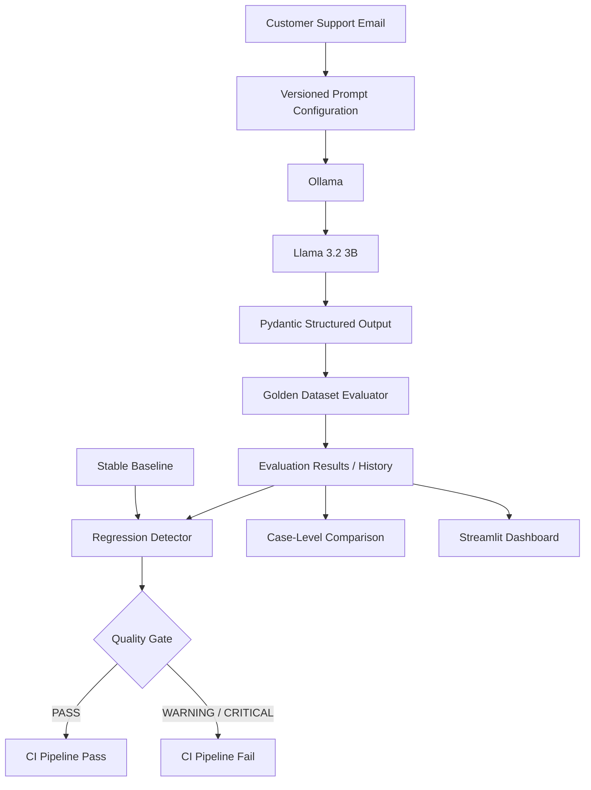
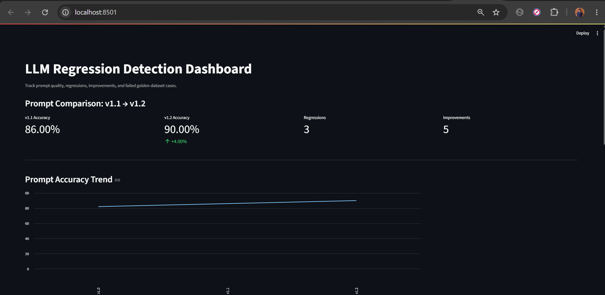

# LLM Regression Detection System

A CI/CD-style evaluation framework for detecting quality regressions in LLM-powered customer support classification when prompts or models change.

## Key Features

- Versioned prompts using YAML
- 50-case human-verified golden dataset
- Local LLM inference with Ollama + Llama 3.2 3B
- Structured JSON output validation with Pydantic
- Accuracy tracking across prompt versions
- Case-level regression and improvement detection
- Stable baseline comparisons
- Streamlit evaluation dashboard
- GitHub Actions quality gate
- Dockerized execution

## Results

| Prompt Version | Accuracy |
|---|---:|
| v1.0 | 82% |
| v1.1 | 86% |
| v1.2 | 90% |

Prompt **v1.2 improved classification accuracy by 8 percentage points over v1.0**, from 82% to 90%, on the same 50-case golden dataset.

## Architecture



## Evaluation Workflow

The system follows this evaluation pipeline:

1. Load a versioned prompt configuration.
2. Run customer-support test cases through Llama 3.2 3B using Ollama.
3. Validate structured model outputs with Pydantic.
4. Compare predicted categories against the golden dataset.
5. Store evaluation results for each prompt version.
6. Compare the current evaluation against a stable baseline.
7. Identify case-level regressions and improvements.
8. Apply a CI quality gate based on regression thresholds.

## Project Structure

```text
LLM-Regression-Detection-System/
├── app/
├── baselines/
├── dashboard/
├── datasets/
├── evaluator/
├── history/
├── prompts/
├── .github/
│   └── workflows/
├── .dockerignore
├── Dockerfile
├── requirements.txt
└── README.md
```

## Run Locally

### 1. Create a virtual environment

```powershell
python -m venv .venv
.\.venv\Scripts\Activate.ps1
```

### 2. Install dependencies

```powershell
pip install -r requirements.txt
```

### 3. Install the local LLM

Install Ollama and pull Llama 3.2 3B:

```powershell
ollama pull llama3.2:3b
```

Verify the model:

```powershell
ollama list
```

### 4. Validate the golden dataset

```powershell
python datasets/validate_dataset.py
```

### 5. Run the evaluation

```powershell
python evaluator/run_evaluation.py
```

### 6. Run regression detection

```powershell
python evaluator/regression_detector.py
```

Example result:

```text
Baseline accuracy: 86.00%
Current accuracy:  90.00%
Accuracy change:   +4.00%

Regression status: PASS
CI RESULT: PASS
```

### 7. Run case-level analysis

```powershell
python evaluator/case_comparison.py
```

This identifies:

- Regressed test cases
- Improved test cases
- Stable passing cases
- Stable failing cases

## Evaluation Dashboard

Launch the Streamlit dashboard:

```powershell
streamlit run dashboard/app.py
```

The dashboard provides a visual overview of evaluation accuracy, prompt-version performance, regression results, and historical evaluation runs.



## Docker

Build the Docker image:

```powershell
docker build -t llm-regression-system .
```

Run the regression detector inside Docker:

```powershell
docker run --rm llm-regression-system
```

## CI/CD

GitHub Actions automatically performs validation when relevant project files change.

The CI pipeline checks:

- Python dependencies
- Golden dataset validity
- Python syntax
- Stable regression baseline
- Regression quality gate

The regression detector returns an appropriate process exit code, allowing GitHub Actions to fail the workflow when the configured regression threshold is exceeded.

## Golden Dataset

The evaluation dataset contains **50 human-verified customer-support examples** across four categories:

- Billing
- Technical
- Account
- General

The dataset includes straightforward and challenging examples such as ambiguous requests, authentication problems, billing disputes, multilingual inputs, short messages, and multi-issue requests.

## Prompt Versioning

Prompt configurations are maintained as versioned YAML files.

The project currently evaluates:

| Version | Accuracy | Change vs. v1.0 |
|---|---:|---:|
| v1.0 | 82% | — |
| v1.1 | 86% | +4 pp |
| v1.2 | 90% | +8 pp |

This demonstrates how prompt changes can be evaluated quantitatively before being accepted into an LLM-powered application.

## Tech Stack

**Language:** Python  
**LLM:** Llama 3.2 3B  
**Local Inference:** Ollama  
**Validation:** Pydantic  
**Configuration:** YAML  
**Dashboard:** Streamlit  
**CI/CD:** GitHub Actions  
**Containerization:** Docker  
**Version Control:** Git & GitHub

## Purpose

LLM applications can change behavior when prompts, models, or configurations are modified. Traditional software tests alone cannot reliably detect these quality changes.

This project demonstrates an LLMOps-style regression testing workflow where model behavior is continuously evaluated against a known golden dataset before changes are accepted.

